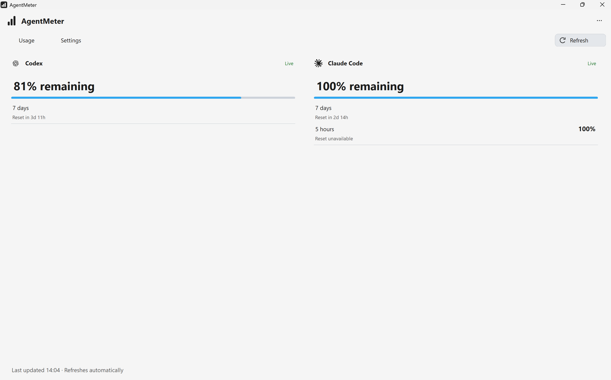
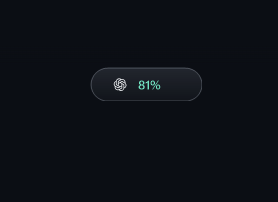
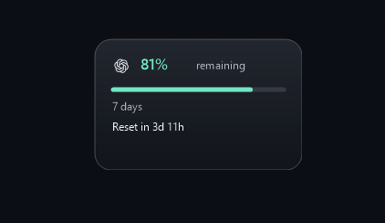

# AgentMeter

AgentMeter monitors Codex and Claude Code usage on **macOS and Windows**, with a native usage window and a compact monitor that appears when supported sessions are active.

## Download AgentMeter

| | macOS | Windows |
| --- | --- | --- |
| **Store** | Mac App Store — **Coming soon** | Microsoft Store — **Coming soon** |
| **Direct download** | [GitHub Release · Public beta](https://github.com/Praneshsivasankaran/AgentMeter/releases/tag/macos-0.1.0-beta.3) | GitHub Release — **Coming soon** |
| **Status** | Public beta; Apple signing, notarization and App Store distribution pending | Microsoft Store submission candidate; Store publication pending |
| **Source** | [`/macos`](macos/) | [`/windows`](windows/) |

The macOS beta requires macOS 14 or later and is currently unsigned. Read the [installation notes](docs/macos/INSTALL.md); do not disable Gatekeeper. Windows source targets Windows 10 version 2004 or later, x64. Neither Store release is live yet.

GitHub is AgentMeter's official product, source and direct-download home. Direct builds for both platforms are planned; [distribution requirements](docs/DISTRIBUTION.md) apply independently to each channel.

## See it in action

| macOS | Windows |
| --- | --- |
|  |  |
| Native SwiftUI and AppKit | Native Windows Forms |

**macOS notch monitor**

**Windows desktop monitor**

| Compact | Expanded on hover |
| --- | --- |
|  |  |

[More screenshots and capture details](assets/screenshots/README.md). Windows views are separate real captures, not an animation.

## What it does

- Shows remaining allowance, reset information and explicit loading, stale and unavailable states.
- Keeps Codex and Claude Code independent so one unavailable provider does not block the other.
- Shows a contextual notch/top-edge monitor on macOS and a movable desktop monitor on Windows.
- Expands on hover, opens Usage on click, and provides native menu-bar or tray controls.
- Supports optional launch at login/startup and System, Light and Dark appearance.

AgentMeter refreshes every 30 seconds through your separately installed, authenticated Codex CLI and standalone Claude Code. Desktop apps can trigger the monitor; allowance comes from those CLI tools. Use the same subscription account across clients. Provider interfaces can change, and unavailable values are never estimated.

## Privacy

No AgentMeter account, telemetry, analytics or backend. AgentMeter does not read prompts, responses, source code, terminal contents or keystrokes, and does not copy provider credentials. Usage checks send no model prompts. Provider tools retain their own authentication and contact their own services. [Privacy policy](PRIVACY.md).

## Source and contributions

[macOS build and tests](docs/macos/BUILD.md) · [Windows build and tests](docs/windows/BUILD.md) · [Shared product specification](docs/product-spec/README.md)

Product behavior is specified together and implemented natively on each platform. Start with the shared specification when proposing a change, and identify any platform differences.

[Report an issue](https://github.com/Praneshsivasankaran/AgentMeter/issues/new/choose) · [Contribute](CONTRIBUTING.md) · [Report a security concern](SECURITY.md)

AgentMeter's original source is [MIT licensed](LICENSE). [Third-party materials and trademarks retain their own terms](THIRD-PARTY-NOTICES.md). AgentMeter is independent of OpenAI and Anthropic.
