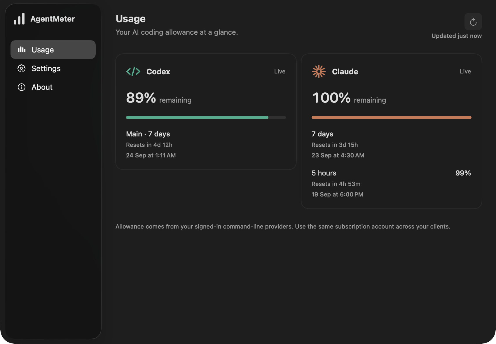

# AgentMeter

I kept checking my coding-agent usage manually, so I made AgentMeter. It puts the remaining allowance somewhere easier to glance at.

A small native macOS utility for keeping an eye on coding-agent usage. A contextual notch monitor, a menu-bar item, and a full usage window. No AgentMeter account.

## Download

**[Download macOS Beta](https://github.com/Praneshsivasankaran/AgentMeter/releases/tag/macos-0.1.0-beta.3)** — 0.1.0 beta 3, for macOS 14 or later.

This technical beta is **not Developer ID signed or notarized** and may be blocked by Gatekeeper. [Read the installation notes](docs/macos/INSTALL.md) before opening it, or [build from source](docs/macos/BUILD.md).

## On your desktop

On macOS, the monitor appears when a supported coding tool is active. Hover for the primary allowance and reset time; click to open the full window. It disappears when activity ends. Macs without a notch use a small top-edge view.

Desktop tools count while frontmost with a visible window. Interactive command-line sessions count while open, even when idle. Settings let you control the notch, menu-bar icon, appearance, and launch at login.

AgentMeter reads verified usage through two supported, locally installed tools and refresh every 30 seconds. Missing, signed-out, stale, and unavailable states stay explicit.

## Privacy

No telemetry, analytics, or backend. AgentMeter doesn't inspect prompts, responses, source code, or terminal contents. Authentication stays with the provider's local tools. [Privacy details](PRIVACY.md).

## Build and limitations

- [macOS build instructions](docs/macos/BUILD.md) — Swift, SwiftUI, and AppKit in `macos/`.

The Mac target is macOS 14 or later. Apple Silicon is physically tested on an M2 MacBook Air; Intel is built but not physically tested. Upstream tool changes can temporarily make usage unavailable, and unrecognized command-line modes deliberately don't trigger the monitor. Signed and notarized Mac packaging is the next distribution step.

Found a bug? [Open an issue](https://github.com/Praneshsivasankaran/AgentMeter/issues/new/choose). Please leave out credentials and private conversations. [Contributing](CONTRIBUTING.md) · [Security reports](SECURITY.md).

AgentMeter source is [MIT licensed](LICENSE). [Third-party materials retain their own terms](THIRD-PARTY-NOTICES.md).
